/* © **2024** [Rahul Babu M P](https://linktr.ee/rahulthewhitehat)
All Rights Reserved.
This file is part of the Elecxa project and contains proprietary and
confidential information. Unauthorized copying, distribution, or use
of this file, via any medium, is strictly prohibited.
Proprietary information should not be shared without prior written permission. */

# Elecxa - Multi-Vendor Electronics Marketplace

## Introduction

**Elecxa** is a multi-vendor electronics marketplace app designed to connect local electronics and hardware stores with customers in real time. This app caters to both store owners and customers, providing a seamless platform for product browsing, inventory management, communication, and much more.

The name "Elecxa" signifies connectivity and accessibility in the world of electronics, making it easier for users to find what they need, when they need it, while empowering local stores to expand their reach.

---

## Features Overview

### **1. Customer Features**
- **Browse Stores**: Discover and explore nearby electronics and hardware stores with detailed profiles, including location and contact information.
- **Browse Products**: View a comprehensive list of available products, filterable by type and store, with detailed descriptions.
- **Request Products**: Submit product requests with urgency levels:
  - *Immediately*
  - *Within 3 Days*
  - *Within a Week*
- **Messaging**: Directly communicate with store owners for inquiries or clarifications.
- **View Requests**: Monitor the status of product requests (*Accepted*, *Rejected*, *Pending*) in a structured dashboard.
- **Account Management**: Update profile details, track order history, and manage app settings.

---

### **2. Store Owner Features**
- **Manage Products**: Add, update, and delete products to maintain an up-to-date inventory.
- **Notifications**: Get instant alerts for new customer product requests, with urgency levels and actionable options.
- **Customer Interaction**: Use the built-in messaging system to address customer queries promptly.
- **Dashboard**: Access an intuitive dashboard for managing store information, products, and customer requests.
- **Settings**: Update store details, preferences, and securely log out.

---

### **3. Shared Features**
- **User Role Selection**: Upon signup, users can choose their role as either a "Customer" or "Store Owner."
- **Location-Based Integration**: Powered by Google Maps API, users can locate stores or view store-specific details.
- **Secure Authentication**: Sign up and log in with Firebase Authentication, ensuring data security.
- **Settings**: Comprehensive account management for both customers and store owners.

---

## Technical Stack

- **Frontend**: Flutter (Dart) for building responsive and cross-platform user interfaces.
- **Backend**:
  - Firebase Firestore: Real-time database for seamless data synchronization.
  - Firebase Authentication: Secure login and user management.
  - Firebase Cloud Messaging: Notifications for customer requests and updates.
  - Firebase Storage: Efficient storage and retrieval of product and profile images.

---

## Firebase Configuration

To use **Elecxa**, you need to configure Firebase as follows:

1. **Create a Firebase Project**:
   - Navigate to the [Firebase Console](https://console.firebase.google.com/).
   - Set up a new Firebase project.
2. **Register the App**:
   - Add your app for Android and/or iOS platforms.
   - Download the `google-services.json` file for Android and place it in the `android/app` directory.
3. **Enable Firebase Services**:
   - Enable **Firestore Database** for data storage.
   - Enable **Firebase Authentication** (email, Google).
   - Enable **Firebase Cloud Messaging** for notifications.

---

## Screenshots

### **1. User Role Selection & Login Screens**  

   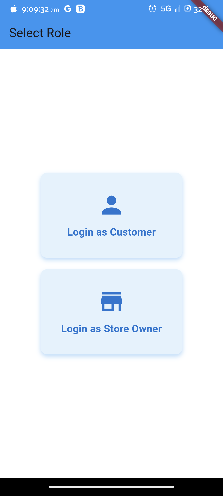
   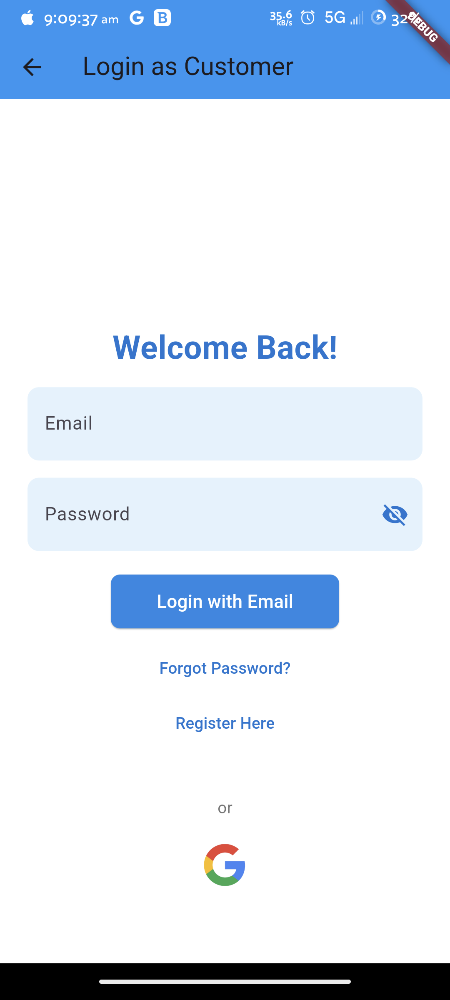
   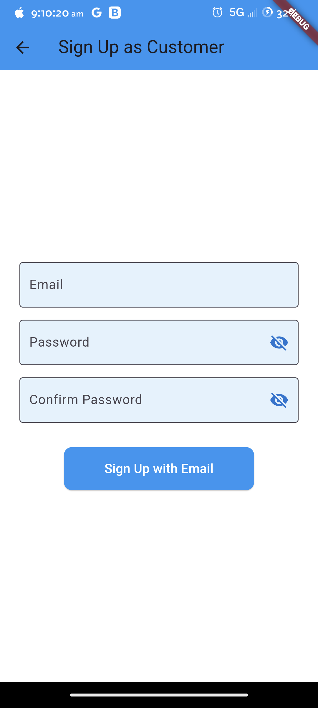

### **2. Customer Dashboard & Product Browsing**  

   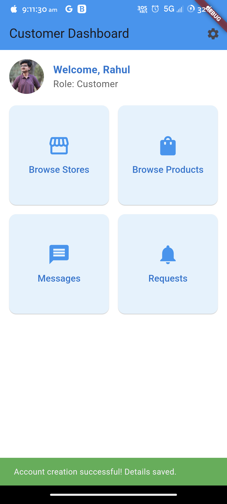
   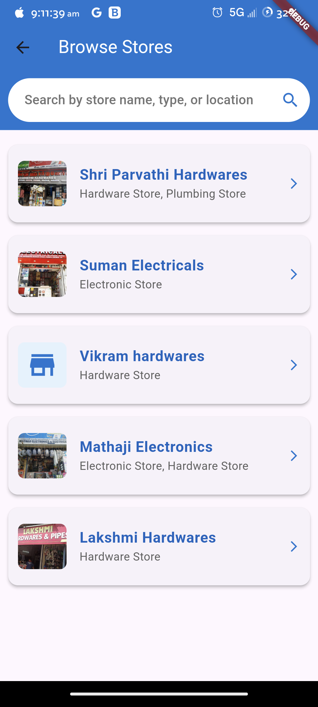
   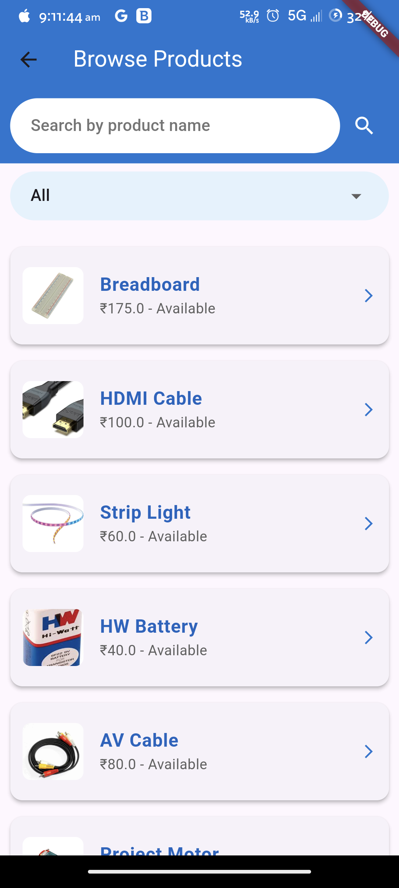

### **3. Store Management**  

   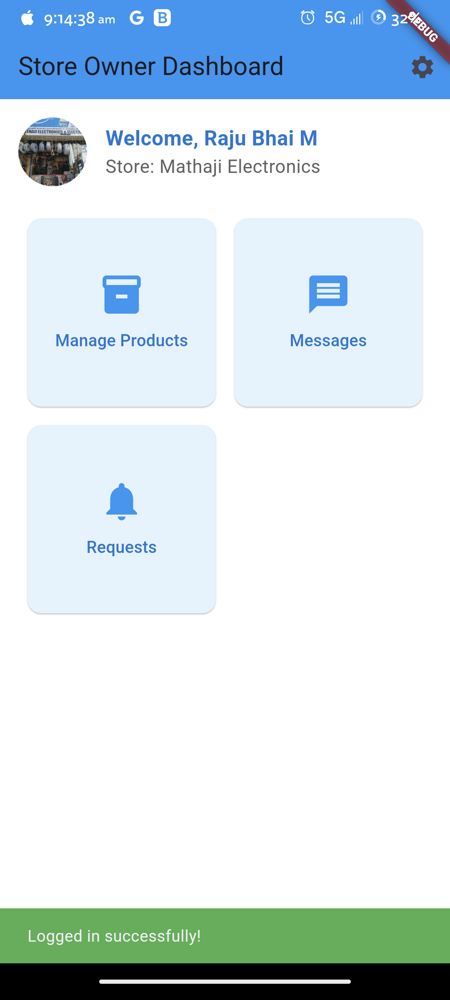
   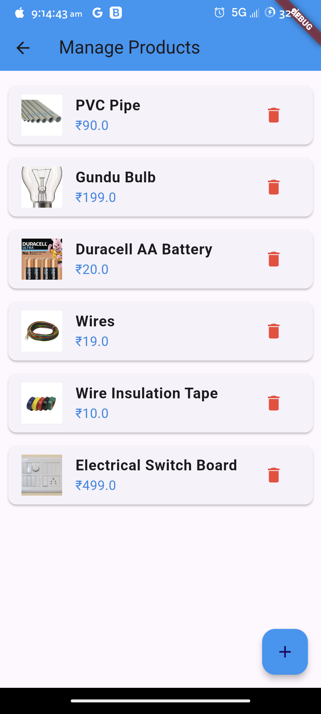
   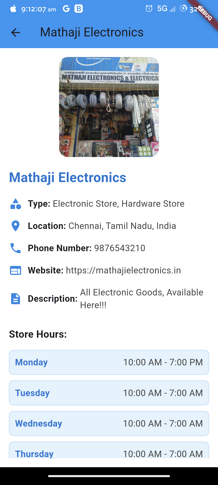

### **4. Messaging & Notifications**  

   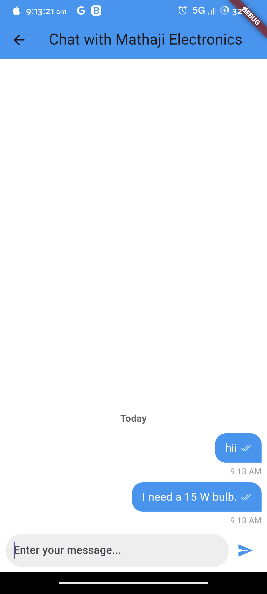
   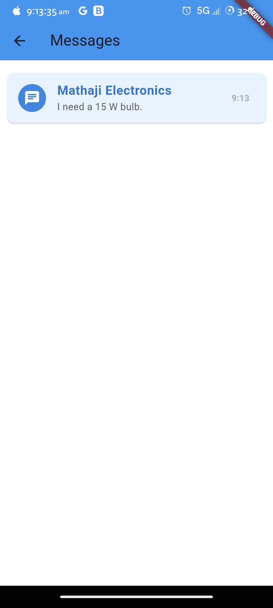
   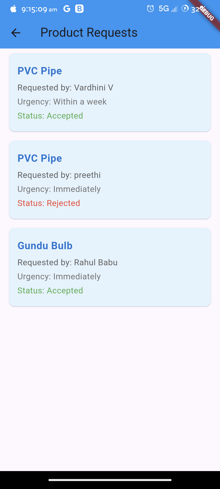

---

## Setup and Installation

### Prerequisites
- **Flutter**: Install the [Flutter SDK](https://flutter.dev/docs/get-started/install).
- **Firebase Account**: Create a Firebase project as mentioned above.

---
   
### Key Goals of Elecxa
**Empowering Local Stores**: Provide a platform for small businesses to reach a wider audience.
**User-Friendly Interface**: Ensure ease of use for both customers and store owners.
**Real-Time Communication**: Enable efficient interactions between customers and vendors.
**Efficient Management**: Simplify store inventory management and customer request handling.

---

### Upcoming Features
**Payment Integration**: Enable in-app payments for seamless transactions.
**Enhanced Search**: Introduce AI-powered product and store recommendations.
**Loyalty Programs**: Reward customers for regular purchases.
**Analytics Dashboard**: Provide store owners with insights into sales and customer behavior.

---

## Contributing

**Thulir** is an open-source project, and contributions are always welcome to enhance and expand its features. If you’d like to contribute:

1. **Fork the Repository**: Click on the "Fork" button at the top of this page.
2. **Create a Branch**: Create a branch specific to the contribution you intend to make.
3. **Make Changes**: Implement your changes or improvements in the new branch.
4. **Create a Pull Request**: Submit your changes for review by creating a pull request.

> Please make sure to follow the project's guidelines and maintain consistency across the app when contributing.

---

## License
**Elecxa** is licensed under the MIT License. Feel free to use and modify the app as per your needs.

## Contact & Support

For more information or support, please reach out via:

- **Email**: [rahulbabuoffl@gmail.com](mailto:rahulbabuoffl@gmail.com)
- **Website**: [My Official Website](https://rahulbabump.online)
- **GitHub Repository**: [GitHub](https://github.com/rahulthewhitehat/elecxa)

**Let Elecxa be your trusted companion for all your electronics and hardware needs! 🌟**

**Elecxa - Multi-Vendor Electronics Marketplace**
